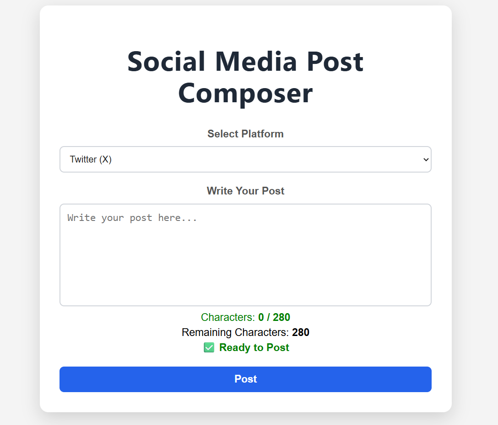
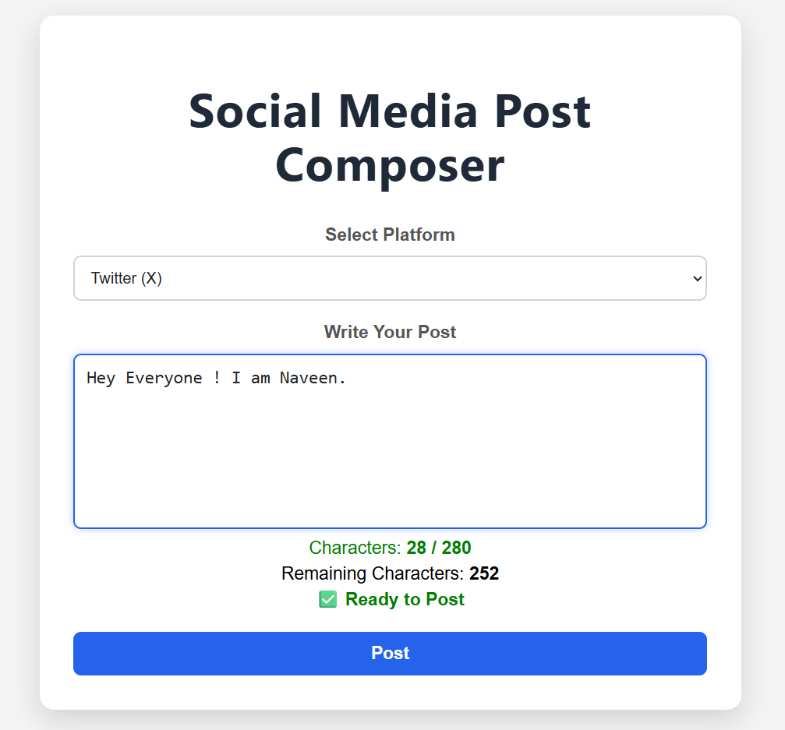
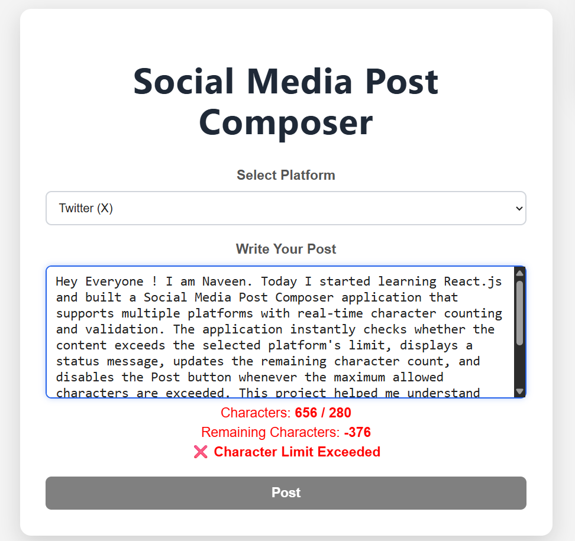

# 📱 Social Media Post Composer

A React.js web application that allows users to compose social media posts with real-time character validation for different platforms.

---

## 🎯 Aim

To design and develop a dynamic post composer interface supporting multiple social media platforms with character limit validation.

---

## ✨ Features

- 🌐 Supports multiple social media platforms
- 🔄 Real-time character counting
- 📊 Remaining character calculation
- ✅ Ready to Post status
- ❌ Character Limit Exceeded validation
- 🚫 Disables the Post button when the limit is exceeded
- 📱 Responsive and clean user interface

---

## 🛠️ Technologies Used

- React.js
- JavaScript (ES6)
- HTML5
- CSS3
- Vite

---

## 📂 Project Structure

```
social-post-composer
│
├── src
│   ├── App.jsx
│   ├── App.css
│   └── main.jsx
│
├── public
├── package.json
├── vite.config.js
└── README.md
```

---

## 🚀 Installation

Clone the repository

```bash
git clone https://github.com/naveenchinni995-pixel/social-post-composer.git
```

Move into the project

```bash
cd social-post-composer
```

Install dependencies

```bash
npm install
```

Run the project

```bash
npm run dev
```

---

## 📸 Screenshots

### Home Screen



### Ready to Post



### Character Limit Exceeded



---

## 👨‍💻 Author

**Naveen Babu**

Bachelor of Engineering (Computer Science & Engineering)

Chandigarh University

---

## 📄 License

This project is developed for educational purposes.